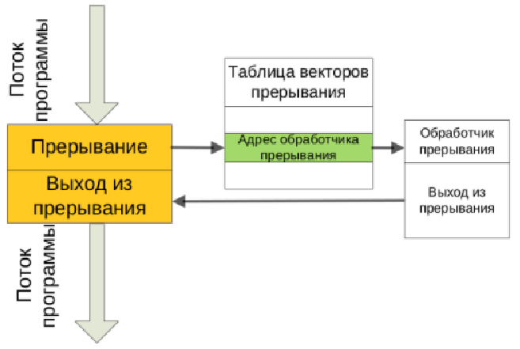
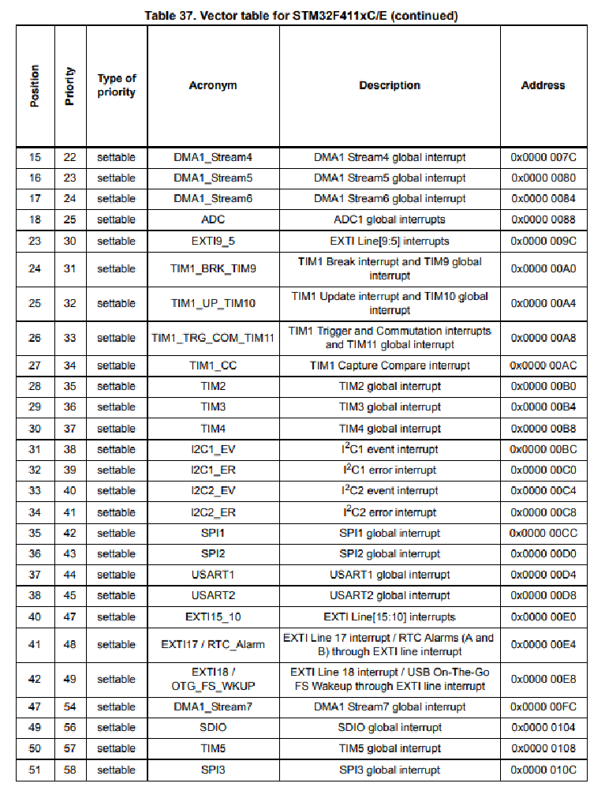
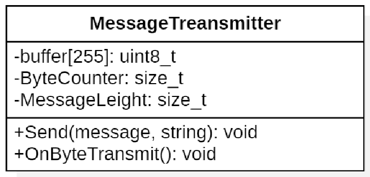
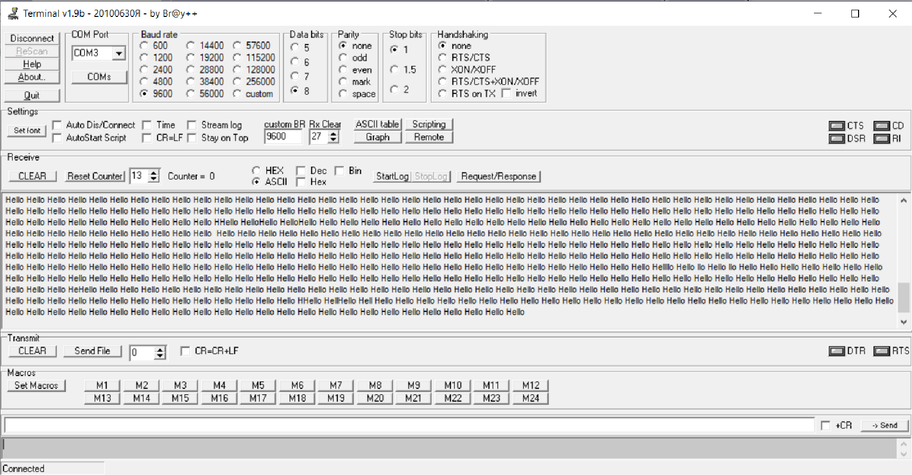

:figure-caption: Рисунок
:table-caption: Таблица

= Лабораторная №1 Думановский А.А. КЭ-413
:toc:
:toc-title: Оглавление:

== Задание
* Описать проделанную работу на лекции 05.02.2022
* Сделать вывод по интерфейсу UART по прерыванию таймера

== Прерывание
Прерывание таймера позволяет  “выйти” из любого выполняемого на данный момент участка кода в основном цикле, выполнить нужный блок кода, который находится внутри прерывания, и вернуться туда, откуда вышли, и продолжить выполнение. Данные действия представлены на рисунке ниже.

Прерывания могут быть:

* Асинхронные - могут происходить в любой момент времени.
* Синхронные - выполняются в определенный момент при выполнении какого-либо условия, например прерывание по ошибки на ноль.
* Программные - инициализируются с помощью специальной команды.
* Маскируемые - могут запрещаться или разрешаться.
* Немаскируемые - не могут запрещаться.

В зависимости от микроконтроллера прерывания могут иметь приоритеты. При это приоритеты могут быть относительными (при поступлении во время обработки прерывания прерывание высшего приоритета выполняется после завершения предыдущего) или абсолютными (при поступлении во время обработки прерывания прерывание высшего приоритета выполняется сразу).

Вектор прерывания - закрепленный за устройством номер, которой идентифицирует соответствующий обработчик прерываний. Все прерывания объединяются в таблицу векторов прерываний, после обращения к которой вызывается определенное прерывание. Таблица прерываний находится в "библии" на страницах 201-204.

Управление и обработка прерываниями производится контроллером приоритетных векторов прерываний NVIC, который является частью ядра Cortex-M

== Описание интерфейса UART

UART означает универсальный асинхронный приёмопередатчик и определяет протокол или набор правил для обмена последовательными данными между двумя устройствами. UART — очень простой протокол, в котором используется только два провода между передатчиком и приемником для передачи и приема в обоих направлениях. Оба конца также имеют заземление. Связь в UART может быть симплексной (данные передаются только в одном направлении), полудуплексной (каждая сторона осуществляет передачу, но только по очереди), или полнодуплексной (обе стороны могут передавать одновременно). Данные в UART передаются в виде кадров.

Одним из больших преимуществ UART является его асинхронность — передатчик и приемник не используют общий тактовый сигнал. Хотя это значительно упрощает протокол, данное свойство предъявляет определенные требования к передатчику и приемнику. Поскольку у них нет общего тактового сигнала, оба конца должны передавать с одинаковой заранее заданной скоростью, чтобы иметь одинаковую синхронизацию битов.

== Разработка программы

Создаем класс, который будет передавать сообщение. Он будет содержать следующие методы:

* Send(message, string): void - посылает строку сообщения.
* OnByteTransmit(): void - метод который будет пересылать конкретный символ, а после запрещать передачу

В классе будут содержаться следующие атрибутты:

* buffer[255]: uint8_t - буффер, в который будем копировать строку и брать ее для пересылки.
* ByteCounter: size_t - счетчик, который считает сколько байт уже было передано.
* MessageLeight: size_t - передает длину сообщения

== Работа с программой

Строки содержат комментарии, в которых описано, что они делают.

Необходимо добавить в таблицу векторов прерывания 38 строку с вызовом прерывания USART
[source, c++]
  InterruptHandler::Usart2Handler,        //Usart2Handler

Описываем функцию прерывания USART
[source, c++]
 static void Usart2Handler() // Прерывание USART
    {
      if (USART2::SR::TXE::Value1::IsSet()) // Проверка на опустошение регистра данных
      {
        MessageTransmitter::OnByteTransmit();
      }
    }

=== Файл MessageTransmitter.cpp

[source, c++]
#include "messagetransmitter.h"
#include "usart2registers.hpp" //for USART2
void MessageTransmitter::Send(const std::string& message) // Передача ссылки на сообщение
{
if(MesTransmit)
{
MesTransmit= false;
//копирование строки в буфер
std::copy_n(message.begin(),message.size(),buffer.begin());
ByteCounter = 0;
MessageLeight=message.size();
USART2::DR::Write(buffer[ByteCounter]);
ByteCounter++;
  USART2::CR1::TE::Value1::Set();//разрешаем передачу
  USART2::CR1::TXEIE::Value1::Set();//разрешаем прерывание по опустошению буффера
  }
}
void MessageTransmitter::OnByteTransmit()
{
  if(ByteCounter<= MessageLeight)
  {
  USART2::DR::Write(buffer[ByteCounter]); // Передача хранящегося байта
  ByteCounter++;
}
else
{
MesTransmit= true;
USART2::CR1::TE::Value0::Set();//запрещаем передачу
USART2::CR1::TXEIE::Value0::Set();//запрещаем прерывание по опустошению буффера
}
}

=== Файл main.cpp
[source, c++]
#include "gpiocregisters.hpp" //for Gpioc
#include "gpioaregisters.hpp" //for Gpioa
#include "rccregisters.hpp"   //for RCC
#include "tim2registers.hpp"   //for SPI2
#include "nvicregisters.hpp"  //for NVIC
#include "tim3registers.hpp"   //for SPI2
#include "usart2registers.hpp"  //for TIM3
#include <string>
#include <messagetransmitter.h>
using namespace std ;
constexpr auto SystemClock = 8'000'000U;
constexpr auto TimerClock = 1'000U;
constexpr auto TimerPrescaller =SystemClock/TimerClock;
//constexpr auto Time = 0.5U;
//constexpr auto Delay = 5000'000;
extern "C"
{
int __low_level_init(void)
{
//Switch on internal 8 MHz oscillator
RCC::CR::HSEON::On::Set() ;
while (!RCC::CR::HSERDY::Ready::IsSet())
{
}
//Switch system clock on external oscillator
RCC::CFGR::SW::Hse::Set() ;
while (!RCC::CFGR::SWS::Hse::IsSet())
{
}
RCC::AHB1ENR::GPIOAEN::Enable::Set();
RCC::AHB1ENR::GPIOCEN::Enable::Set(); //Подали тактирование на порт GPIOC
GPIOC::MODER::MODER8::Output::Set();  //Настроили порт PORTC.8 на выход
GPIOC::MODER::MODER5::Output::Set();  //Настроили порт PORTC.5 на выход
//   GPIOC::MODER::MODER9::Output::Set();  //Настроили порт PORTC.9 на выход
//   GPIOA::MODER::MODER5::Output::Set();  //Настроили порт PORTC.5 на выход
RCC::AHB1ENR::GPIOAEN::Enable::Set();
// Настройка на альтернативный режим
GPIOA::MODER::MODER2::Alternate::Set();
GPIOA::MODER::MODER3::Alternate::Set();
GPIOA::AFRL::AFRL2::Af7::Set(); //Tx usart2
GPIOA::AFRL::AFRL3::Af7::Set(); //Rx usart2
// настройка таймера
RCC::APB1ENR::TIM2EN::Enable::Set(); // Подали тактирование
TIM2::PSC::Write(TimerPrescaller); // Скорость
TIM2::ARR::Write(1000); // Время прерывания, мс
TIM2::CNT::Write(0);// Начало отсчета
NVIC::ISER0::Write(1<<28U); // Разрешить глобальное прерывание TIM2
TIM2::DIER::UIE::Enable::Set();// Прерывание по переполнению
TIM2::CR1::CEN::Enable::Set(); // Включение таймера
RCC::APB1ENR::TIM3EN::Enable::Set();// Подали тактирование
TIM3::PSC::Write(TimerPrescaller); // Скорость
TIM3::ARR::Write(500); // Время прерывания, мс
TIM3::CNT::Write(0); // Начало отсчета
NVIC::ISER0::Write(1<<29U); // Разрешить глобальное прерывание TIM3
TIM3::DIER::UIE::Enable::Set(); // Прерывание по переполнению
TIM3::CR1::CEN::Value1::Set();
RCC::APB1ENR::USART2EN::Enable::Set();
USART2::CR1::OVER8::Value1::Set();
USART2::CR1::M::Value1::Set();
USART2::CR1::PCE::Value0::Set();
USART2::BRR::Write(16'000'000/(9600));
USART2::CR1::UE::Value1::Set();
NVIC::ISER1::Write(1<<6U);
return 1;
}
}
int main()
{
std::string testmes="Hello ";
MessageTransmitter::Send(testmes); // поссылка сообщения
for(;;)
{
MessageTransmitter::Send(testmes);
}
return 0 ;
}

== Результат

