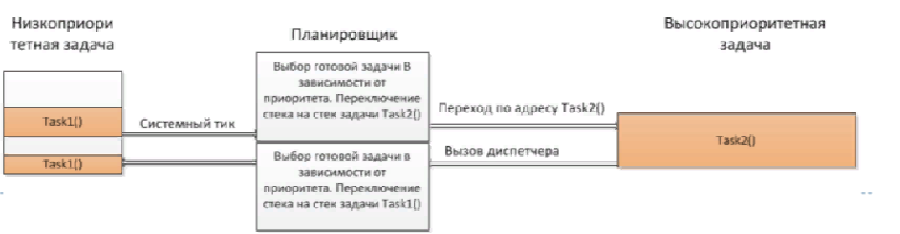
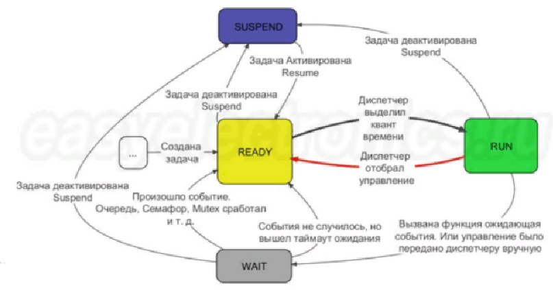
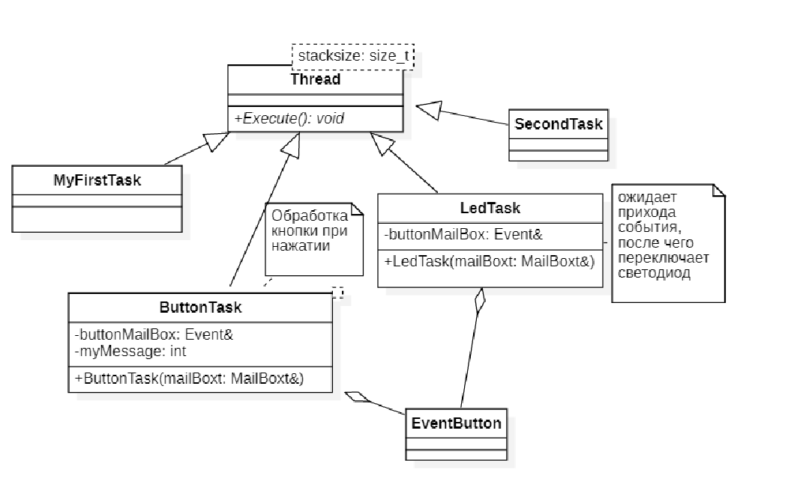

:figure-caption: Рисунок
:table-caption: Таблица

= Лабораторная №14 Думановский А.А. КЭ-413
:toc:
:toc-title: Оглавление:

== Задание
* Описать проделанную работу на лекции 12.02.2022
** Рассмотреть теорию
** Написать программу, которая будет моргать тремя светодиодами:
*** с задержкой 1 секунда;
*** в цикле длительностью в пол секунды;
*** по нажатию на кнопку

== Операционные системы реального времени (ОСРВ)

ОСРВ предназначены для обеспечения интерфейса к ресурсам критических по времени системах является своевременность (timeless) выполнения обработки данных.
Задачей ОСРВ является обеспечение реакции на определенное действие за отведенный квант времени. Для разных задач квант может иметь разное значение.

Временем реакции системы на события - интервал времени от события на объекте и до выполнения первой инструкции в программе обработки этого события. Интервал времени определяется свойствами операционной системы и  архитектурой микроконтроллера.

ОСРВ упрощают разработку той программы, где необходимо паралельно обрабатывать множество действий, в том числе можно без особого труда добавить дополнительные, что позволяет расширить программу, однако в слишком тривиальных задачах она лишь дополнительно усложнит задачу.

ОСРВ обеспечивает многозадачность (или псевдомногозадачность). Существует 2 версии многозадачности:

* "Мягкого" реального времени программа либо выполняется за определенное время либо нет.

* "Жесткого" реального времени - каждая задача должна выполняться за отведенный квант времени, невыполнение ведет к краху системы.

В ОСРВ используются задачи, которые вызываются планировщиком каждый раз по прерыванию системного таймера либо при непосредственном вызове планировщика.
Каждый раз планировщик пробегается по списку задач выбирает задачу готовую к работе.

В кооперативной многозадачности планировщик смотрит завершена ли текущая зада и готова ли задача с большим приоритетом. В вытесняющем режиме планировщик лишь  смотрит готовую задачу в большим приоритетом и в случае чего прерывает менее приоритетную.

Один из таймеров микроконтроллера настраивают на генерацию системных тиков. Каждый тик - это вызов прерывания таймера в котором вызывается планировщик.

Free RTOS - бесплатная многозадачная операционная система реального времени для встраиваемых систем. Планировщик системы простой, но при этом позволяет задать приоритеты процессов, вытесняющую и невытесняющую многозадачность, очереди.

Задача - это мини подпрогамма, которая имеет свою точку входа, и исполняется внутри бесконечного цикла, Имеет собственный приоритет, стек, идентификатор. Задача может находить в нескольких состояниях и переходить в одно из другого.

== Разработка программы

Все задачи должны наследовать класс Tread, который содержит в себе основные функции.

Создаем задачу MyFirstTask, цель которой моргать одним светодиодом. Она должна наследовать класс Tread, содержащий виртуальный метод Execute(), который мы будем переопределять. Делаем описание класса, после с наследуемого класса переопределяем метод Execute(), внутри которого описываем наше действие: зажигание светодиода раз в 1000 мс.

[source, c++]
for(;;)
  {
    GPIOC::ODR::Toggle(1U << 8U);
    Sleep(1000ms);
  }

Далее подключаем метод в основной класс, при этом назначая приоритет:
[source, c++]
MyFirstTask myFirstTask;
M
int main()
{
 using namespace OsWrapper;
 Rtos::CreateThread(myFirstTask, "MyFirstTask", ThreadPriority::highest);
 Rtos::Start();
 return 0;
}

Аналогично делаем для другого светодиода, разница будет в том, что вместо функции Sleep(1000ms) используем SleepUntil(500ms). Функция SleepUntil(500ms) обеспечивает задержку программы не в 500 милисекунд, а ДО 500 милисекунд, т.е. если на зажигание светодиода тратится например 5 милисекунд, команда даст заснуть на 495.

Следующая программа будет зажигать светодиод по нажатию кнопки.

Необходимо создать класс опроса кнопки ButtonTask. В данном классе реализуется посылка события в систему по нажатию. Данный класс также будет наследовать метод Tread  с целью переопределения метода.
Этот метод будет передавать ссылку на событие в EventButton. В данном методе проверяем нажата ли кнопка и если да, то отправляем событие с помощью посылки сообщения MailBox.
[source, c++]
void ButtonTask::Execute()
{
for(;;)
{
if(GPIOC::IDR::IDR13::Low::IsSet())
{
ButtonMailBox.Put(myMessage);
}
Sleep(100ms);
}
}

Также необходимо создания класса EventButton который будет ожидать события, а после посылать их, этот метод будет агрегирован в класс ButtonTask.Ожидание события реализуется в Main:
[source, c++]
OsWrapper::Event ButtonEvent{500ms, 1};

Создадим класс LedTask который будет наследовать метод Tread и отвечать за зажигание светодиода по приходу события. В данном методе код реализован так, чтобы по приходу сообщения о том, что кнопка нажата, загорался светодиод, при этом команда засыпает на время, равное времени опроса кнопки, а в случае если сообщения о том что кнопка нажата нет, светодиод бы гас. Данная структура позволяет простым способом оформить зажигание светодиода по нажатию кнопки

[source, c++]
void LedTask::Execute()
{
 int resivedMessage;
  for(;;)
  {
    if (ButtonMailBox.Get(resivedMessage, 100) == true)
    {
   // GPIOC::ODR::Toggle(1U << 9U);
      GPIOC::ODR::ODR9::High::Set();
      Sleep(100ms);
    }
    GPIOC::ODR::ODR9::Low::Set();
  }
} ;

Полная структура кода:

