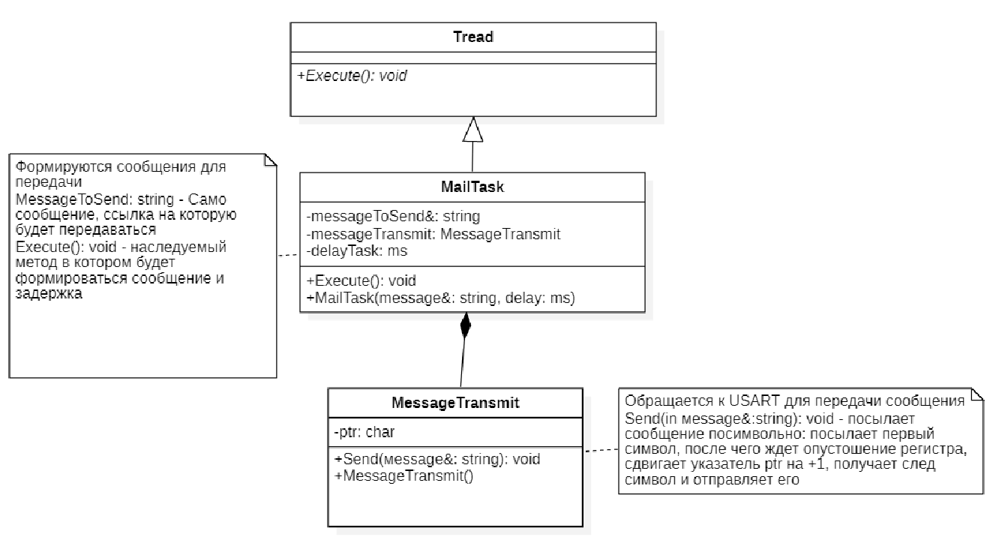
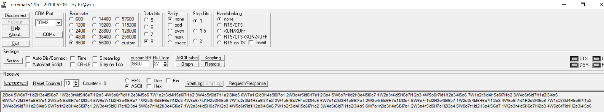
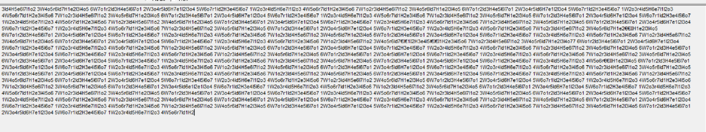

:figure-caption: Рисунок
:table-caption: Таблица

= Лабораторная №16 Думановский А.А. КЭ-413
:toc:
:toc-title: Оглавление:

== Задание
* Разработать программу, которая бы посылала 2 различных сообщения: "HelloWorld" раз в 100 мс с нормальным приоритетом и сообщение "1234567" раз в 119 мс с высоким приоритетом
** Разработать структуру команды
** Написать программу и посмотреть результат
** Реализовать класс Mutex

== Разработка структуры программы

В данной программе будет использоваться 3 класса.

Класс Thread необходим для реализации задач по ОСРВ.

В классе MailTask происходит наследование и переопределение метода Execute() класса Thread, формирование сообщения для передачи и его задержка delayTask:ms в миллисекундах.

В классе MessageTransmit осуществляется передача сообщения по USART посимвольно.

== Код программы

Файл  messagetransmit

[source, c++]
#include "messagetransmit.h"
#include "usart2registers.hpp" //for USART2
#include <array>
#include <string>
void MessageTransmit::Send(std::string& message)
{
    USART2::DR::Write(*ptr);
    while(USART2::SR::TXE::DataRegisterNotEmpty::IsSet())
    {
    }
     ptr++;
    if(*ptr == 0)
    {
      ptr= message.c_str();
     }
 }

Файл  mailtask

[source, c++]
#include "mailtask.h"
#include <array>
#include <string>
#include "messagetransmit.h"
void MailTask::Execute()
{
for(;;)
{
messageTransmit.Send(messageToSend);
Sleep(delayTask);
}
}
MailTask::MailTask(std::string& message,std::chrono::milliseconds delay) : messageToSend(message), delayTask(delay)
{
}

Файл  main

[source, c++]

#include "rtos.hpp"         // for Rtos
#include "mailbox.hpp"      // for Mailbox
#include "event.hpp"        // for Event
#include "mailtask.h"
#include "messagetransmit.h"
#include "mytask.hpp"       // for MyTask
#include "led1task.hpp"     // for Led1Task
#include "rccregisters.hpp" // for RCC
#include "usart2registers.hpp" //for USART2
#include "myfirsttask.h" // for MyFirstTask
#include "mysecondtask.h" // for MyFirstTask
#include "buttontask.h" // for MyFirstTask
#include "ledtask.h"     // for LedTask
#include "Application/Diagnostic/GlobalStatus.hpp"
#include <gpioaregisters.hpp>  // for GPIOA
#include <gpiocregisters.hpp>  // for GPIOC
#include <string>
#include <messagetransmit.h>
std::uint32_t SystemCoreClock = 16'000'000U;
extern "C" {
int __low_level_init(void)
{
//Switch on external 16 MHz oscillator
RCC::CR::HSION::On::Set();
while (RCC::CR::HSIRDY::NotReady::IsSet())
{
}
  RCC::CFGR::SW::Hsi::Set();
  while (!RCC::CFGR::SWS::Hsi::IsSet())
 {
  }
  RCC::AHB1ENRPack<
      RCC::AHB1ENR::GPIOCEN::Enable,
      RCC::AHB1ENR::GPIOAEN::Enable
  >::Set();
  RCC::APB2ENR::SYSCFGEN::Enable::Set();
  GPIOC::MODERPack<
      GPIOC::MODER::MODER5::Output,
      GPIOC::MODER::MODER8::Output,
      GPIOC::MODER::MODER9::Output
  >::Set();
   GPIOA::MODER::MODER2::Alternate::Set();
   GPIOA::MODER::MODER3::Alternate::Set();
   GPIOA::AFRL::AFRL2::Af7::Set(); //Tx usart2
   GPIOA::AFRL::AFRL3::Af7::Set(); //Rx usart2
   RCC::APB1ENR::USART2EN::Enable::Set();
   USART2::CR1::OVER8::OversamplingBy16::Set();
   USART2::CR1::M::Data8bits::Set();
   USART2::CR1::PCE::ParityControlDisable::Set();
   USART2::BRR::Write(16'000'000/(9600));
   USART2::CR1::UE::Enable::Set();
  return 1;
}
}
  std::string testmes1="Hello World";
  std::string testmes2="1234567";
 MailTask mailTask1(testmes1, 100ms);
 MailTask mailTask2(testmes2, 110ms);
int main()
{
  USART2::CR1::TE::Enable::Set();
  using namespace OsWrapper;
  ThreadPriority::normal);
  Rtos::CreateThread(mailTask1, "MailTask", ThreadPriority::normal);
  Rtos::CreateThread(mailTask2, "MailTask", ThreadPriority::highest);
  Rtos::Start();
  return 0;
}

=== Результат

Как видно, сообщения перемешались, необходимо реализовать класс Mutex.

Класс Mutex - инструмент управления синхронизацией потоков, с помощью которого можно реализовать последовательное выполнение задач. По сути одна из выполняемых задач "захватывает" его и начинает выполняться, а после выполнения "отпускает", после чего его уже может "захватить" другая задача.

Файл  messagetransmit

[source, c++]
#include "messagetransmit.h"
#include "usart2registers.hpp" //for USART2
#include <array>
#include <string>
#include "rtos.hpp"         // for Rtos
#include "mutex.hpp" // for Mutex
extern  OsWrapper::Mutex USARTMutex;
void MessageTransmit::Send(std::string& message) {
      USARTMutex.Lock();
    USART2::DR::Write(*ptr);
    while(USART2::SR::TXE::DataRegisterNotEmpty::IsSet())
    {
    }
     ptr++;
    if(*ptr == 0)
    {
      ptr= message.c_str();
     }
    USARTMutex.UnLock();
 }

Файл  mailtask

[source, c++]
#include "mailtask.h"
#include "messagetransmit.h"
#include <array>
#include <string>
void MailTask::Execute()
{
for(;;)
{
messageTransmit.Send(messageToSend);
Sleep(delayTask);
}
}
MailTask::MailTask(std::string& message,std::chrono::milliseconds delay) : messageToSend(message), delayTask(delay)
{
}

Файл  main

[source, c++]
#include "rtos.hpp"         // for Rtos
#include "mailbox.hpp"      // for Mailbox
#include "event.hpp"        // for Event
#include "mailtask.h"
#include "messagetransmit.h"
#include "mytask.hpp"       // for MyTask
#include "led1task.hpp"     // for Led1Task
#include "rccregisters.hpp" // for RCC
#include "usart2registers.hpp" //for USART2
#include "myfirsttask.h" // for MyFirstTask
#include "mysecondtask.h" // for MyFirstTask
#include "buttontask.h" // for MyFirstTask
#include "ledtask.h"     // for LedTask
#include "Application/Diagnostic/GlobalStatus.hpp"
#include <gpioaregisters.hpp>  // for GPIOA
#include <gpiocregisters.hpp>  // for GPIOC
#include <string>
#include <messagetransmit.h>
#include "mutex.hpp" // for Mutex
std::uint32_t SystemCoreClock = 16'000'000U;
extern "C" {
int __low_level_init(void)
{
//Switch on external 16 MHz oscillator
RCC::CR::HSION::On::Set();
while (RCC::CR::HSIRDY::NotReady::IsSet())
{
  }
  //Switch system clock on external oscillator
  RCC::CFGR::SW::Hsi::Set();
  while (!RCC::CFGR::SWS::Hsi::IsSet())
 {
 }
  //Switch on clock on PortA and PortC
  RCC::AHB1ENRPack<
      RCC::AHB1ENR::GPIOCEN::Enable,
      RCC::AHB1ENR::GPIOAEN::Enable
  >::Set();
  RCC::APB2ENR::SYSCFGEN::Enable::Set();
  //LED1 on PortA.5, set PortA.5 as output
  GPIOA::MODER::MODER5::Output::Set();
  /* LED2 on PortC.9, LED3 on PortC.8, LED4 on PortC.5 so set PortC.5,8,9 as output */
  GPIOC::MODERPack<
      GPIOC::MODER::MODER5::Output,
      GPIOC::MODER::MODER8::Output,
      GPIOC::MODER::MODER9::Output
  >::Set();
   GPIOA::MODER::MODER2::Alternate::Set();
   GPIOA::MODER::MODER3::Alternate::Set();
   GPIOA::AFRL::AFRL2::Af7::Set(); //Tx usart2
   GPIOA::AFRL::AFRL3::Af7::Set(); //Rx usart2
      RCC::APB1ENR::USART2EN::Enable::Set();
   USART2::CR1::OVER8::OversamplingBy16::Set();
   USART2::CR1::M::Data8bits::Set();
   USART2::CR1::PCE::ParityControlDisable::Set();
   USART2::BRR::Write(16'000'000/(9600));
   USART2::CR1::UE::Enable::Set();
  return 1;
}
}
  std::string testmes1="Hello World";
  std::string testmes2="1234567";
 MailTask mailTask1(testmes1, 100ms);
 MailTask mailTask2(testmes2, 110ms);
int main()
{
  OsWrapper::Mutex USARTMutex;
  USART2::CR1::TE::Enable::Set();
  using namespace OsWrapper;
   Rtos::CreateThread(mailTask1, "MailTask", ThreadPriority::normal);
  Rtos::CreateThread(mailTask2, "MailTask", ThreadPriority::highest);
  Rtos::Start();
  return 0;
}

=== Результат

Результат удручающий потому что я не смог исправить следующее:

Немного не понимаю как поставить UnLock так, чтобы он позволял полностью пройти только одному сообщению с текущей архитектурой, по идее все правильно, сообщение одно должно отправляться, но значение месседж постоянно меняется
