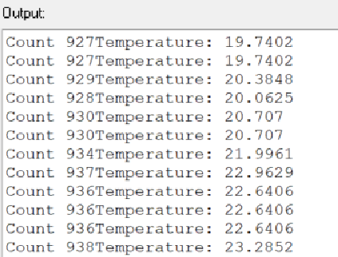

:figure-caption: Рисунок
:table-caption: Таблица

= Лабораторная №1 Думановский А.А. КЭ-413
:toc:
:toc-title: Оглавление:

== Задание

1. Измерить температуру микроконтроллера с помощью АЦП и инженекторных каналов.
2. Для перевода кода АЦП в температуру использовать калибровочный точки, указанные в datasheet на микроконтроллер. Там указан, адреса двух точке, по которым лежат значения кодов температуры при 110 и 30 градусах цельсия.

== АЦП микроконтроллера STM32F411

АЦП(макс 12 разрядов) микроконтроллера STM32F411 работает по принципу последовательного приближения.

* Основные элементы АЦП:

** Наличие регулярных и инжектированных каналов – отличие только в том, что инжектированные каналы могут писать данные в 4 регистра с 4 каналов сразу, а регулярный только в один регистр

** 19 аналоговых каналов, 16 из которых которые могут сконфигурированы на работу от внешних источников или 3 внутренних.

** Внешние каналы поступают на мультиплексор, где выбирается только один из них. Т.е. в один момент времени может быть измерено напряжение только с одного канала.

** Результат преобразования сохраняется в регистрах данных. Для регулярных каналов это только один 16 битный регистр. Для инжектированных – 4.

** Запуск преобразования может быть как программным, так и внешним. Внешний запуск может происходить от таймеров или с двух внешних входов.

== Схема АЦП микроконтроллера STM32F411

image::image-2021-12-17-21-30-06-641.png[]

== Режим одиночного преобразования

В этом режиме АЦП находится сразу после сброса. Бит CONT регистра ADC_CR2 равен 0.

* Для начала работы с АЦП в этом режиме нужно

** Настроить нужный порт, подключенный к нужному каналу АЦП на аналоговый вход

** Подать тактирование на АЦП

** Выбрать нужный канал для измерения

** Настроить канал АЦП на нужную частоту преобразования

** Включить АЦП

** Начать преобразование

** Дождаться флага готовности преобразования

** Считать преобразованное значение

== Работа с программой

[source, c++]
#include "adc1registers.hpp" //for ADC1
#include "adccommonregisters.hpp" //for ADCCommon
#include "gpioaregisters.hpp" //for Gpioa
#include "gpiocregisters.hpp" //for Gpioc
#include "rccregisters.hpp" //for RCC
#include "tim2registers.hpp" //for TIM2
#include <iostream>
extern "C"
{
int __low_level_init(void)
{
//Switch on external 8 MHz oscillator
 RCC::CR::HSEON::On::Set() ;
 while (!RCC::CR::HSERDY::Ready::IsSet())
 {
 }
 RCC::CFGR::SW::Hse::Set() ;
 while (!RCC::CFGR::SWS::Hse::IsSet())
 {
 }
 //********* ADC1 setup
 //Switch on clock on ADC1
 RCC::APB2ENR::ADC1EN::Enable::Set();
 //Switch On internal tempearture sensor
 ADC_Common::CCR::TSVREFE::Enable::Set();
 ADC1::JSQR::JSQ4::Channel18::Set();
 //Set single conversion mode
 ADC1::CR1::RES::Bits12::Set();
 ADC1::CR2::CONT::SingleConversion::Set();
 ADC1::CR2::EOCS::SingleConversion::Set();
 // Set 84 cycles sample rate for channel 18
 ADC1::SMPR1::SMP18::Cycles84::Set();
 // Set laentgh of conversion sequence to 1
 ADC1::JSQR::JL::Set(0x00);
 // Connect first conversion on Channel 18
 ADC1::JSQR::JSQ4::Set(18);
 return 1;
}
}
constexpr float B1 = (25.0F - 0.76F/0.0025F); // see datacheet (page 226) and calculate B coeficient here ;
constexpr float K1 = (3.3F/4096.0F)/0.0025F ; // see datcheet ((page 226)) and calculate K coeficient here ;
int main()
{
uint32_t data = 0U ;
float temperature = 0.0F ;
 ADC1::CR2::ADON::Set(1);
 for(;;)
 {
 //**************ADC*****************
 // Enable ADC1
 //Start conversion
 ADC1::CR2::JSWSTART::On::Set();
 // wait until Conversion is not complete
 while(ADC1::SR::JEOC::ConversionNotComplete::IsSet())
 {
}
 //Get data from ADC
 data = ADC1::JDR1::Get();
 //float volt = (3.3f+static_cast<float>data)/4096.0f;
 temperature = static_cast<float>(data) * K1 + B1 ; //Convert ADC counts to temperature
 std::cout << "Count " << data << "Temperature: " << temperature << std::endl ;
 }
}

== Результат

На рисунке показано значение температуры в квартире, после чего ее начали нагревать.

== Нерешенные задачи:

* Реализовал только на 4 канале.

* Не смог выполнить вторую задачу, поскольку не совсем понял как можно выцепить значение напряжения с диапазона регистров.