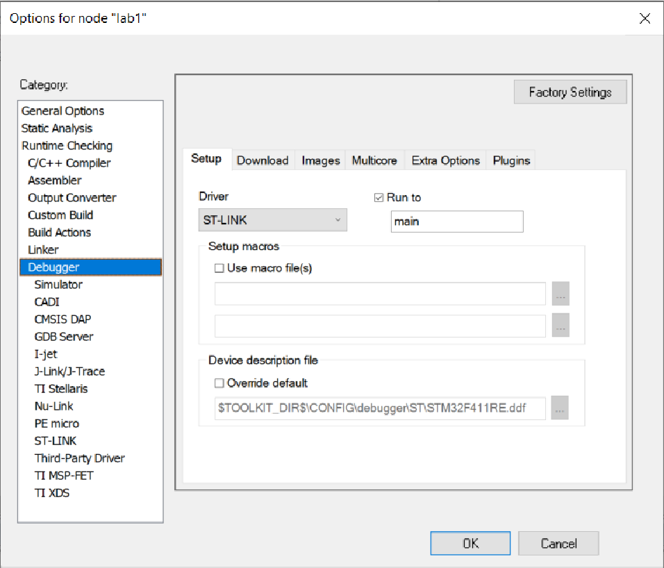
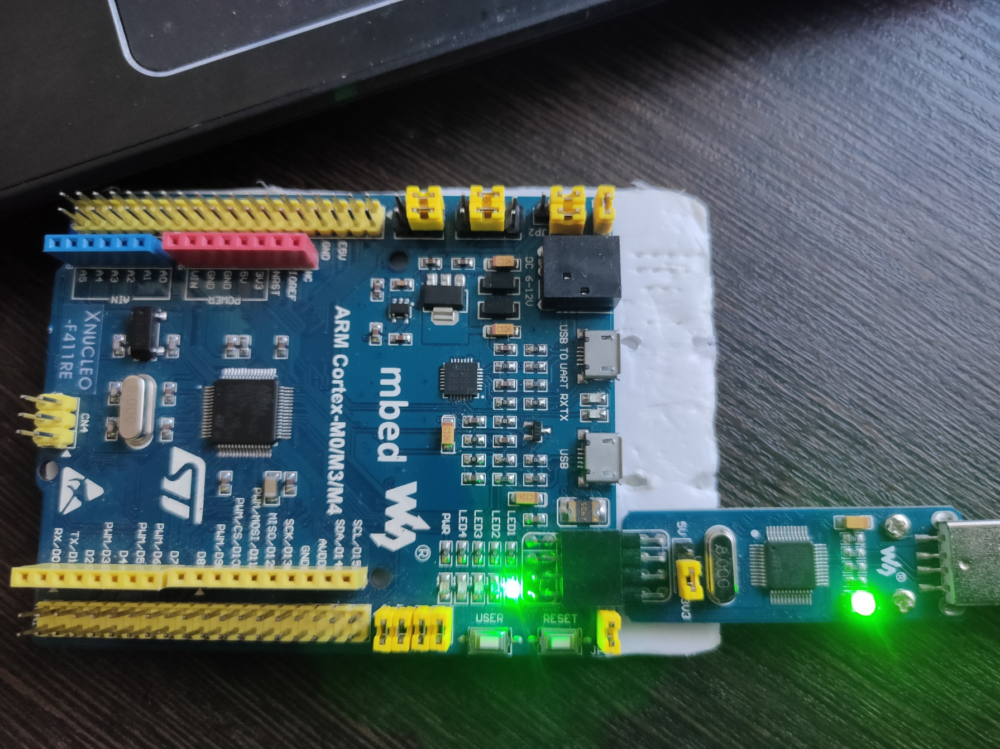
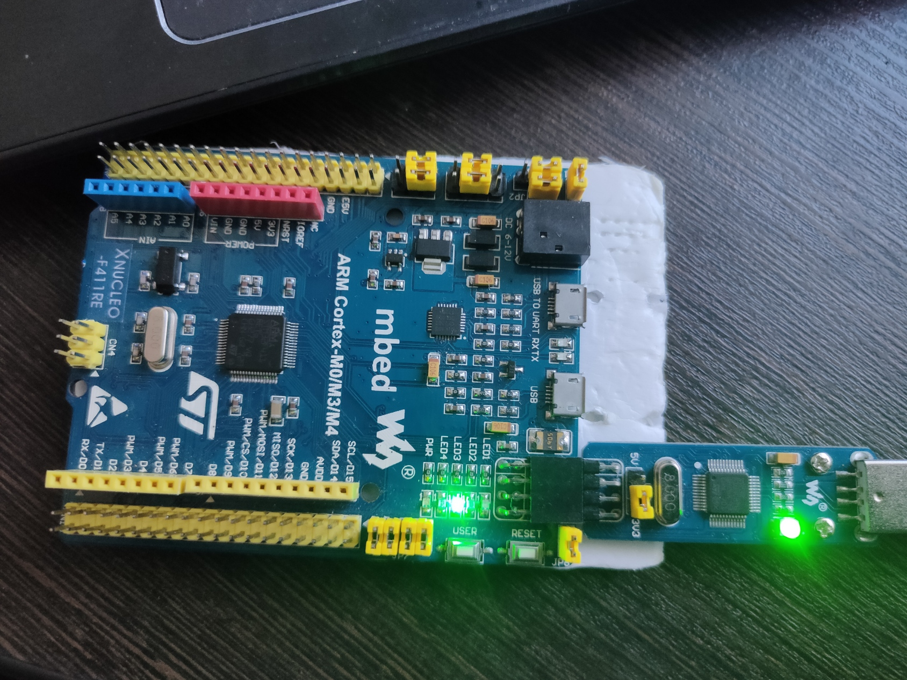
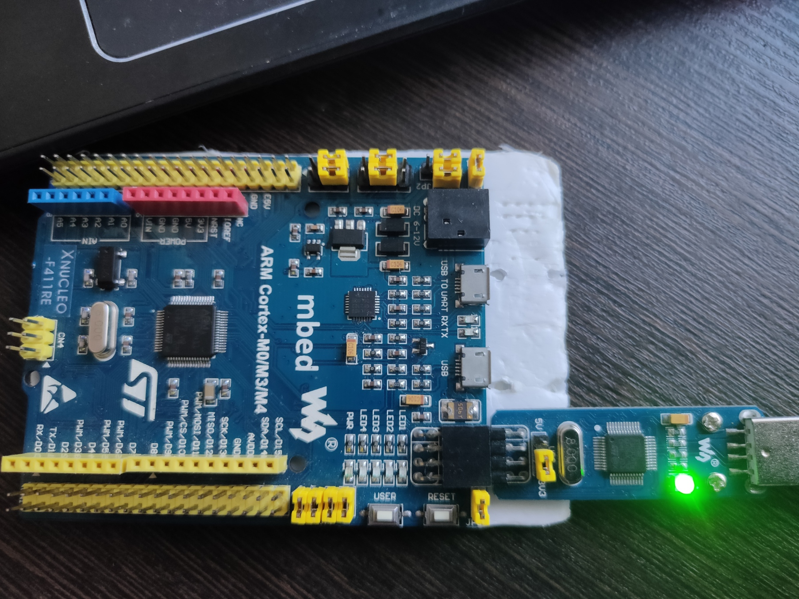

= Лабораторная №1

== Задание
1. Сделать бегущий огонь из 4 светодиодов, подключенных к портам C.5, C.8, C9, A.5
2. Заготовка лежит с настройками портов светодиодов лежит в https://github.com/lamer0k/stm32Labs/tree/master/Lab1
3. Сделать отчет как обычно

== Работа с программой

Запустили необходимый файл, выбали необходимую плату.

image::image-2021-09-29-23-17-13-190.png[]

Выбрали необходиммый отладчик.

Для начала создаем таймер.
Также необходимо указать оптимизатору чтобы он не "выкидывал" данную часть кода.
----
int delay(int time)
{
 for (int i = 0; i < time; ++i)
 {
  asm volatile("");
 }
}
----
После включаем порты на которых находятся диоды и обозначаем их как выходы. Далее прописываем поочередное включение и выключение диодов.
----
 int main()
  {
   RCC::AHB1ENR::GPIOCEN::Enable::Set() ;
   RCC::AHB1ENR::GPIOAEN::Enable::Set() ;
   GPIOA::MODER::MODER5::Output::Set();
   GPIOC::MODER::MODER9::Output::Set() ;
   GPIOC::MODER::MODER8::Output::Set() ;
   GPIOC::MODER::MODER5::Output::Set() ;
   for(int j=0;j<1000;++j)//поскольку не рекомендуется использовать бесконечный цикл
    {
     GPIOA::ODR::ODR5::High::Set();
     delay(1000000);
     GPIOA::ODR::ODR5::Low::Set();
     delay(1000000);
     GPIOC::ODR::ODR9::High::Set();
     delay(1000000);
     GPIOC::ODR::ODR9::Low::Set();
     delay(1000000);
     GPIOC::ODR::ODR8::High::Set();
     delay(1000000);
     GPIOC::ODR::ODR8::Low::Set();
     delay(1000000);
     GPIOC::ODR::ODR5::High::Set();
     delay(1000000);
     GPIOC::ODR::ODR5::Low::Set();
     delay(1000000);
    }
 return 0;
 }
----
В результате диоды поочередно загораются "сверху вниз" с одинаковой задержкой. После окончания цикла они начинают светиться по новой.

На рисунках представлены некоторые состояния платы:

