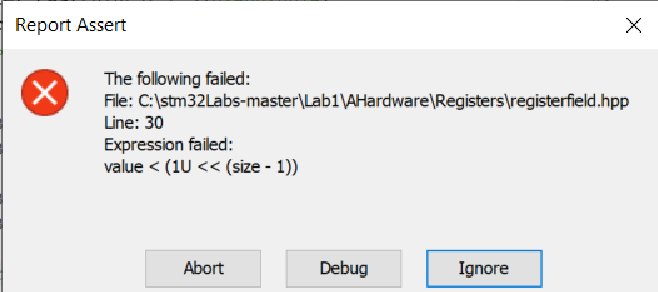

:figure-caption: Рисунок
:table-caption: Таблица
= Лабораторная №1 Думановский А.А. КЭ-413
:toc:
:toc-title: Оглавление:

== Задание

* Написать программу, которая моргает всеми 4 светодиодами, но без использования магии с GPIOA::ODR::ODR5::High::Set() и тому подобное; а только прямой доступ к памяти по адресам, только хардкор.
* Тактирование системной частоты произвести с модуля PLL, так, чтобы системная частота была 30 МГц.

== Работа с программой
Запустили необходимый файл, выбали необходимую плату.

image::image-2021-09-29-23-17-13-190.png[]

Выбрали необходиммый отладчик.

image::image-2021-09-29-23-18-28-635.png[]

Устройства STM32F411xC / E имеют две схемы Pll:

* Основная система Pll, синхронизируемая генератором HSE или HSI и имеющая два разных выходных часов:
- Первый выход используется для генерации высокоскоростных системных часов (до 100 МГц)
- Второй выход используется для генерации часов для USB OTG FS (48 МГц) и SDIO (≤ 50 МГц).

Выберем внешний генератор HSE с частотой 8 Мгц. После чего необходимо настроить Pll на нужную частоту. Существует 3 способа настройки частоты

* f(VCO clock) = f(PLL clock input) × (PLLN / PLLM)
* f(PLL general clock output) = f(VCO clock) / PLLP
* f(USB OTG FS, SDIO) = f(VCO clock) / PLLQ

В нашем случае подходит первый способ. При этом PLLN принимает значения: 50 ≤ PLLN ≤ 432, а PLLM: 2 ≤ PLLM ≤ 63. Для получения из частоты 8 МГц 30 МГц необходимо умножить на 60 и разделить на 16.

Включаем нужный источник и дожидаемся его стабилизации. Настраиваем PLL, включаем его, дожидаемся его стабилизации, назначаем его на системную частоту, и дожидаемся пока не переключится. Ниже представлен код данных действий:

[source, c++]
#include "rccregisters.hpp" // for RCC
#include "gpioaregisters.hpp" //for Gpioa
#include "gpiocregisters.hpp" //for GPIOC
std::uint32_t SystemCoreClock = 8'000'000U;
extern "C"
{
int __low_level_init(void)
{
RCC::CR::HSEON::On::Set();
while (RCC::CR::HSERDY::NotReady::IsSet())
{
}
RCC::PLLCFGR::PLLN0::Set(60);
RCC::PLLCFGR::PLLM0::Set(16);
RCC::CR::PLLON::On::Set();
while (RCC::CR::PLLRDY::Unclocked::IsSet())
{
}
RCC::CFGR::SW::Pll::Set();
while (!RCC::CFGR::SWS::Pll::IsSet())
{
}

Поскольку функция PLLM0 отсутствует, необходимо внести изменения в файл  #include "rccregisters.hpp". Также следует учесть что  для RCC::CR::PLLRDY::... фунция называется не "NotReady", а "Unclocked".

Далее создаем таймер.
Также необходимо указать оптимизатору чтобы он не "выкидывал" данную часть кода.

[source, c++]
int delay(int time)
{
 for (int i = 0; i < time; ++i)
 {
  asm volatile("");
 }
}

После включаем порты на которых находятся диоды и обозначаем их как выходы. Далее прописываем поочередное включение и выключение диодов. Смотрим каким регисторам они соответсвует и включаем их. При наличии единицы в регистре диод горит, при нулевом значении - не горит.

[source, c++]
int main()
{
  RCC::AHB1ENR::GPIOCEN::Enable::Set() ;
  RCC::AHB1ENR::GPIOAEN::Enable::Set() ;
  GPIOA::MODER::MODER5::Output::Set();
  GPIOC::MODER::MODER9::Output::Set() ;
  GPIOC::MODER::MODER8::Output::Set() ;
  GPIOC::MODER::MODER5::Output::Set() ;
   uint32_t* ptrPaODR = reinterpret_cast<uint32_t*>(0x40020014);
   uint32_t* ptrPcODR = reinterpret_cast<uint32_t*>(0x40020814);
 for(int j=0;j<1000;++j)//Поскольку не рекомендуется использовать бесконечный цикл
 {
   *ptrPaODR ^= static_cast<uint32_t>(1 << 5);//1<<5 = 0001000
   *ptrPcODR ^= static_cast<uint32_t>((1 << 5) | ( 1<< 8) | (1<<9));
   delay(1000000);
   *ptrPaODR ^= static_cast<uint32_t>(1 << 5);
   *ptrPcODR ^= static_cast<uint32_t>((1 << 5) | ( 1<< 8) | (1<<9));
   delay(1000000);
   }
return 0;
}

При запуске появляется ошибка:

Но если ее игнорировать то все работает.

Результат:

image::video_2021-10-21_19-39-35.gif[]