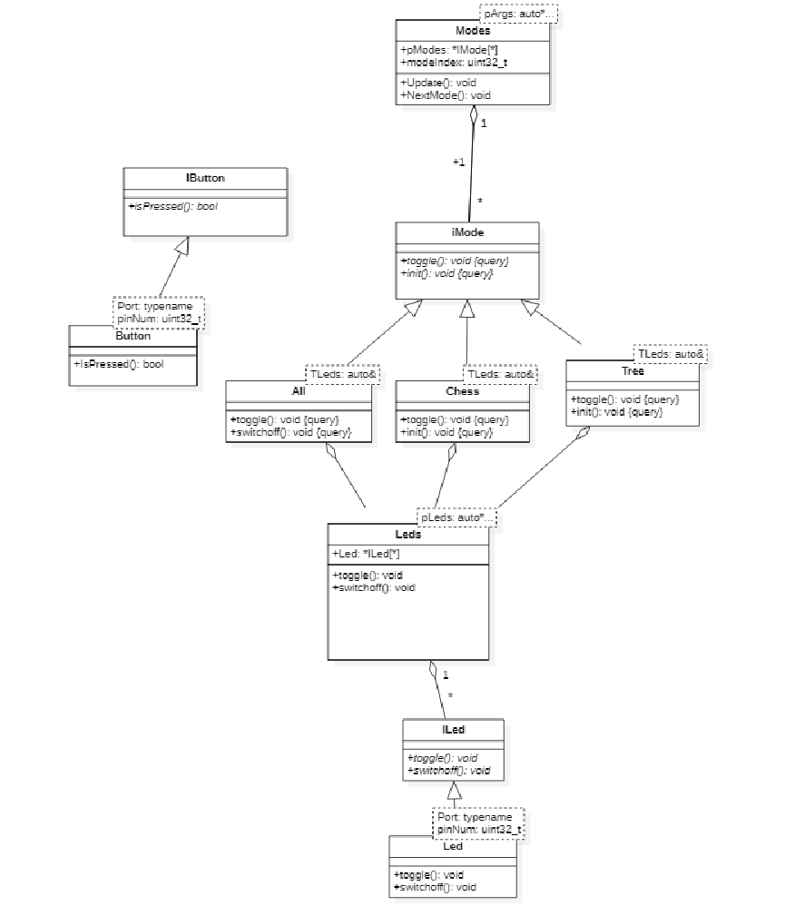

:figure-caption: Рисунок
:table-caption: Таблица

= Лабораторная №1 Думановский А.А. КЭ-413
:toc:
:toc-title: Оглавление:

== Задание

Сделать задержку с помощью таймера, при этом чтобы при переключении режимов она увеличивалась до определенного значения, а после сбрасывалась в начальное (Примерно)

== Работа с программой
Перед построением программы составим ее архитектуру.

Поскольку данная работа является продолжение https://github.com/Sitick/labs/tree/main/Lab7-8-9[старой], весь код представлять смысла особого нет. Представим классы, которые подверглись изменению:

=== Led
Данный класс используется для переопределения функции. Был изменен swicthOff()

[source, c++]
#pragma once
#include "iled.h"
template<typename Port, uint32_t pinNum>
class Led : public ILed
{
public:
  void toggle() override
  {
    Port::ODR::Toggle(1U << pinNum);
  }
  void swicthOff() override
  {
  Port::BSRR::Write(pinNum << 16) ;
  }
};

=== iMode
Виртуальный класс, поскольку для построения мода tree в функции должно меняться значение индеса константой ее оставлять нельзя.

[source, c++]
#pragma once
class IMode
{
public:
virtual void toggle() /*const*/ = 0;
virtual void init()/*const*/ = 0;
};

=== Chess
Мод моргания диодами, было поскольку была увеличена задержка между морганиями, с помощью нее был обнаружен недочет в функции очистки. Поскольку данный мод идет у нас после Tree(), в котором светятся не все диоды (может быть такое что 1, 2 горят а 3 и 4 нет), при переключении может сломаться порядок моргания диода, поэтому перед началом выключим всем диоды.

[source, c++]
#pragma once
#include "imode.h"
template <auto& TLeds>
class Chess : public IMode
{
 public:
 void toggle()  override
 {
  TLeds.toggle();
 }
 void init()  override
 {
  TLeds.swicthOff();
  for ( uint32_t index =0; index < std::size(TLeds.pLeds); ++index)
   {
    if ((index %2)==0)
     {
      TLeds.pLeds[index]->toggle();
     }
   }
 }
};

=== Tree
Мод моргания диодами, поскольку мы убрали у функции const, можем написать ее нормально.

[source, c++]
#pragma once
#include "imode.h"
template <auto& TLeds>
class Tree : public IMode
{
public:
   void toggle()  override
  {
    TLeds.pLeds[index]->toggle();
    index++;
    if(index>= std::size(TLeds.pLeds))
    {
      index=0U;
    }
  }
    void init()  override
  {
   index=0U;
   TLeds.swicthOff();
  }
  private:
  uint32_t index =0;

};

=== Main

[source, c++]
#include "rccregisters.hpp" // for RCC
#include "gpioaregisters.hpp" //for Gpioa
#include "gpiocregisters.hpp" //for GPIOC
#include "led.h"
#include "leds.h"
#include "iled.h"
#include "Button.h"
#include "ibutton.h"
#include "chess.h"
#include "All.h"
#include "Tree.h"
#include "Modes.h"
#include "imode.h"
#include "tim2registers.hpp"   //for SPI2
#include "nvicregisters.hpp"  //for NVIC
constexpr auto SystemClock = 16'000'000U;
constexpr auto TimerClock = 1'000U;
constexpr auto TimerPrescaller =SystemClock/TimerClock;
extern "C"
{
int __low_level_init(void)
{
//Switch on internal 16 MHz oscillator
RCC::CR::HSEON::On::Set() ;
while (!RCC::CR::HSERDY::Ready::IsSet())
{
    }
    //Switch system clock on external oscillator
    RCC::CFGR::SW::Hse::Set() ;
    while (!RCC::CFGR::SWS::Hse::IsSet())
    {
    }
    RCC::AHB1ENR::GPIOAEN::Enable::Set();
    RCC::AHB1ENR::GPIOCEN::Enable::Set(); //Подали тактирование на порт GPIOC
    GPIOC::MODER::MODER8::Output::Set();  //Настроили порт PORTC.8 на выход
    GPIOC::MODER::MODER5::Output::Set();  //Настроили порт PORTC.5 на выход
    GPIOC::MODER::MODER9::Output::Set();  //Настроили порт PORTC.9 на выход
    GPIOA::MODER::MODER5::Output::Set();  //Настроили порт PORTC.5 на выход
    // настройка таймера
    RCC::APB1ENR::TIM2EN::Enable::Set();
  return 1;
}
}
void DelayMs (uint32_t value)
{
const auto delay =  TimerClock * value/ 1000U ;
TIM2::PSC::Write(TimerPrescaller);
TIM2::ARR::Write(delay);
TIM2::SR::UIF::NoInterruptPending::Set();
TIM2::CNT::Write(0U);
TIM2::CR1::CEN::Enable::Set();
while(TIM2::SR::UIF::NoInterruptPending::IsSet())
{
}
    TIM2::SR::UIF::NoInterruptPending::Set();
    TIM2::CR1::CEN::Disable::Set();
 }
Led<GPIOA, 5U> led1;
Led<GPIOC, 5U> led2;
Led<GPIOC, 8U> led3;
Led<GPIOC, 9U> led4;
Leds<&led2,&led3, &led4,&led1> leds;
Button<GPIOC, 13U> userButton;
Chess<leds> chessMode;
All<leds> allMode;
Tree<leds> treeMode;
Modes<&allMode, &treeMode, &chessMode> modes;
int main()
{
auto delay = 200U;
for (;;)
{
if (delay >1000U)
{
delay=200U;
}
if (userButton.IsPressed())
{
modes.NextMode();
delay+=200;
}
    modes.Update();
     DelayMs(delay);
  }
  return 1;
}

== Результат

Извиняюсь, но его нет поскольку я не могу сжать GIF до разрешенных 25 МБ, а на коротком не будет заметно увеличение задержки.