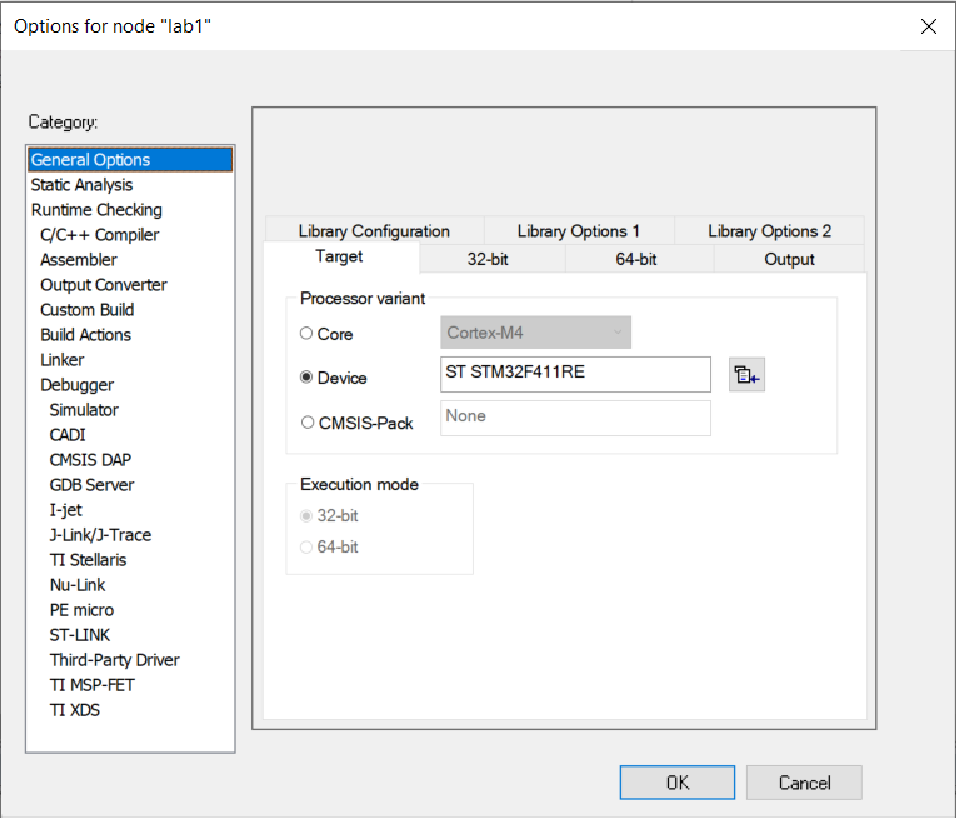

:figure-caption: Рисунок
:table-caption: Таблица

= Лабораторная №1 Думановский А.А. КЭ-413
:toc:
:toc-title: Оглавление:

== Задание

* Используя интерфейсы (абстрактный класс) для кнопки и светодиода
* Используя контейнер(контроллер) для светодиодов, который содержит в себе массив указателей на интерфейс из пункта 1.
* Контроллер светодиодов должен поддерживать 2 режима работы светодоиодов (моргают все светодиоды, и режим "елочка")
* Если успеете, нужно сделать еще и 3 режим, моргают четные и нечетный светодиоды в противофазе

== Работа с программой
Запустили необходимый файл, выбали необходимую плату.

Выбрали необходимый отладчик.

Подключаем необходимые шины, назначаем порты диодов как Выход, на скорости "Medium Speed", а кнопку как Вход на такой же скорости.

Код подключения представлен ниже:
[source, c++]
RCC::APB2ENR::SYSCFGEN::Enable::Set();
RCC::AHB1ENR::GPIOAEN::Enable::Set(); // Подключаем к шине
RCC::AHB1ENR::GPIOCEN::Enable::Set(); // Подключаем к шине
GPIOA::OSPEEDR::OSPEEDR5::MediumSpeed::Set();
GPIOA::MODER::MODER5::Output::Set();
GPIOC::OSPEEDR::OSPEEDR5::MediumSpeed::Set();
GPIOC::MODER::MODER5::Output::Set();
GPIOC::OSPEEDR::OSPEEDR9::MediumSpeed::Set();
GPIOC::MODER::MODER9::Output::Set();
GPIOC::OSPEEDR::OSPEEDR8::MediumSpeed::Set();
GPIOC::MODER::MODER8::Output::Set();
GPIOC::OSPEEDR::OSPEEDR13::MediumSpeed::Set();
GPIOC::MODER::MODER13::Input::Set();

Перед построением программы составим ее архитектуру.

Распишем каждый класс и его функции:

=== Led
Данный класс используется для переопределения функции.

[source, c++]
#pragma once
#include "iled.h"
template<typename Port, uint32_t pinNum>
class Led : public ILed
{
public:
  void toggle() override
  {
    Port::ODR::Toggle(1U << pinNum);
  }
};

=== Leds
В данном классе описаны функции модов мигания диодов и их переключения

[source, c++]
#pragma once
#include "gpioaregisters.hpp" //for Gpioa
#include "gpiocregisters.hpp" //for GPIOC
#include "iled.h"
template <auto* ...pArgs>
class Leds
{
public:
 void NextMode()
 {
  if (mode == Mode::chess)
    {
      mode = static_cast<Mode>(static_cast<int32_t>(mode) - 3U);
    }
  mode = static_cast<Mode>(static_cast<int32_t>(mode) + 1U);
  SwitchOff();
 }
 void Update()
 {
  switch(mode)
   {
     case Mode::toggle:
     toggle();
     break;
     case Mode::tree:
     tree();
     break;
     case Mode::chess:
     chess();
     break;
   }
}
private:
 void toggle()
  {
   for(size_t i = 0; i < sizeof ...(pArgs); ++i)
    {
     pLeds[i]->toggle();
    }
  }
 void tree()
  {
    pLeds[index]->toggle();
	if (flagTree)
     {
      index++;
     }
	else
     {
	  index--;
     }
    if(index == sizeof ...(pArgs))
     {
	  index = 3U;
      flagTree = false;
     }
    if (index > sizeof ...(pArgs))
     {
      index = 0U;
      flagTree = true;
     }
  }
 void chess()
  {
   if (flagChess)
    {
     for(size_t i = index; i < sizeof ...(pArgs); i += 2)
     pLeds[i]->toggle();
	 flagChess = false;
    }
   else
    {
     for(size_t i = index; i < sizeof ...(pArgs); i += 2)
     pLeds[i]->toggle();
     if (!index)
      {
       index = 1;
      }
     else
      {
       index = 0;
      }
	 for(size_t i = index; i < sizeof ...(pArgs); i += 2)
     pLeds[i]->toggle();
    }
   }
 void SwitchOff()
  {
   GPIOA::ODR::ODR5::Low::Set() ;
   GPIOC::ODR::ODR5::Low::Set() ;
   GPIOC::ODR::ODR8::Low::Set() ;
   GPIOC::ODR::ODR9::Low::Set() ;
   index = 0U;
   flagChess = true;
   flagTree = true;
  }
ILed* pLeds[sizeof ...(pArgs)] = {pArgs...};
size_t index =0U;
bool flagChess = true, flagTree = true;
enum class Mode
 {
  toggle = 0,
  tree =1,
  chess = 2
 } mode;

=== Button

Класс описывающий функцию отжима кнопки

[source, c++]
#pragma once
#include "ibutton.h"
template<typename Port, uint32_t pinNum>
class Button: public IButton
{
public:
bool IsPressed() override
{
 bool result = false;
 // Если кнопка прижата
 if(((Port::IDR::Get())&(1U << pinNum)) == 0)
 {
 //ждем пока не отпуститсся
    result = true;
 }
 return result;
}
};

=== ileds и ibutton
Виртуальные классы

[source, c++]
#pragma once
class ILed
{
 public:
 virtual void toggle() = 0;
};

[source, c++]
#pragma once
class IButton
{
 public:
 virtual bool  IsPressed() = 0;
};

=== Main
В результате в мейне остается только подключить созданные  классы:
[source, c++]
Led<GPIOA, 5U> led1;
Led<GPIOC, 5U> led2;
Led<GPIOC, 8U> led3;
Led<GPIOC, 9U> led4;
Leds<&led2,&led3, &led4,&led1> leds;
Button<GPIOC, 13U> userButton;
int main()
 {
  for (;;)
   {
    if (userButton.IsPressed())
     {
       leds.NextMode();
       delay(1000000);
     }
      leds.Update();
      delay(1000000);
   }
return 1;
}

== Результат

image::video_2021-11-18_22-20-10.gif[]